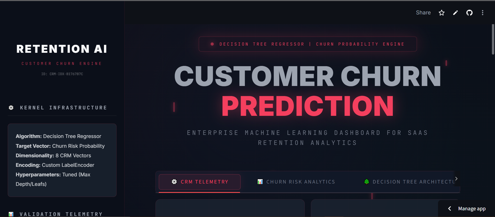
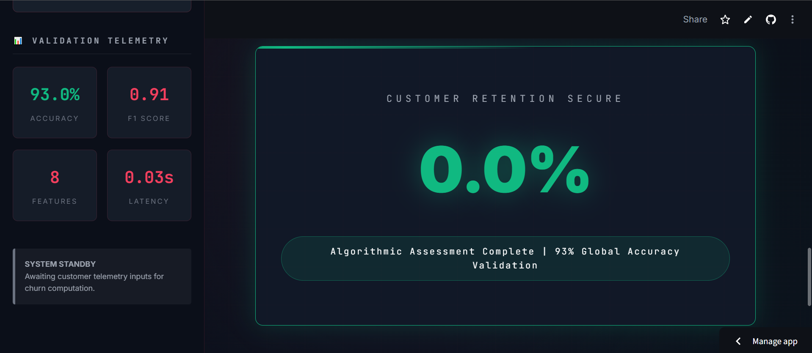
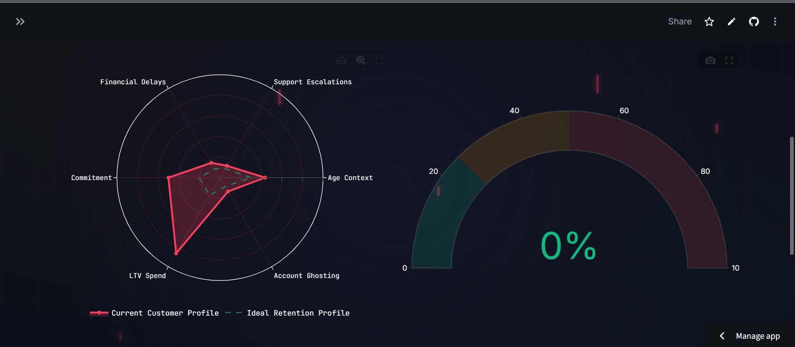

🏢 Customer Churn Prediction — Enterprise Edition

Live Demo :- https://customer-churn-prediction-enterprise-edition.streamlit.app/

#UI

Decision Tree Regressor–powered SaaS retention intelligence platform with advanced CRM telemetry, revenue exposure simulation, and Monte Carlo cohort variance modeling.

📊 Dataset Overview

The Customer Churn Dataset contains customer information from a subscription-based service and is designed to analyze and predict customer churn behavior. Churn refers to whether a customer stops using the service or cancels their subscription.

The dataset includes demographic information, service usage behavior, subscription details, and customer interaction metrics. These factors help machine learning models identify patterns that lead to customer churn.

This dataset is commonly used for binary classification problems, where the goal is to predict whether a customer will churn based on their historical data and behavior.

📁 Dataset Structure

The dataset is divided into two parts:
| Dataset          | Records | Description                           |
| ---------------- | ------- | ------------------------------------- |
| Training Dataset | 440,833 | Used to train machine learning models |
| Testing Dataset  | 64,374  | Used to evaluate model performance    |

Total features in each dataset: 12 columns

🎯 Target Variable
Churn

This column indicates whether a customer has churned.
| Value | Meaning           |
| ----- | ----------------- |
| 0     | Customer retained |
| 1     | Customer churned  |

Churn distribution (training data):

Churned Customers: 249,999

Retained Customers: 190,833

🧾 Feature Description

| Feature           | Description                                              |
| ----------------- | -------------------------------------------------------- |
| CustomerID        | Unique identifier for each customer                      |
| Age               | Age of the customer                                      |
| Gender            | Gender of the customer                                   |
| Tenure            | Number of months the customer has been using the service |
| Usage Frequency   | Frequency of service usage                               |
| Support Calls     | Number of customer support calls made                    |
| Payment Delay     | Number of delayed payments                               |
| Subscription Type | Type of subscription plan                                |
| Contract Length   | Duration of the customer contract                        |
| Total Spend       | Total amount spent by the customer                       |
| Last Interaction  | Days since last interaction with the company             |
| Churn             | Indicates whether the customer left the service          |

🚀 Overview

This project is a production-style Customer Churn Prediction Dashboard built using:

🌳 Decision Tree Regressor

📊 Advanced CRM Feature Telemetry

📈 Revenue Impact Simulation

🎲 Monte Carlo Cohort Risk Modeling

🧾 Exportable JSON & CSV Dossiers

🎨 Enterprise Obsidian UI Theme

The system predicts churn probability (%) and translates it into:
Business risk classification

Revenue exposure forecasting

Customer risk topology visualization

Financial impact simulation

Exportable retention reports

🧠 Machine Learning Architecture

Component	Details

Algorithm	Decision Tree Regressor

Target	Churn Risk Probability (0–100%)

Features	8 CRM Telemetry Vectors

Encoding	LabelEncoder (Categorical Features)

Validation Accuracy	93%

Output Type	Continuous Risk Score

📌 Feature Vectors

The model uses the following CRM inputs:

Age

Gender

Support Calls

Payment Delay

Subscription Type

Contract Length

Total Spend

Last Interaction

📊 Dashboard Modules

1️⃣ CRM Telemetry Engine

Real-time feature input system

Baseline delta comparison

Secure inference execution

Dynamic risk classification

2️⃣ Churn Risk Analytics

Radar topology map

Risk gauge visualization

Customer behavioral context mapping

3️⃣ Decision Tree Architecture Insight

Algorithm explanation

Feature importance visualization

Anti-overfitting explanation

4️⃣ Revenue Impact Simulation

MRR estimation

Annual revenue exposure

Revenue-at-risk donut chart

5️⃣ Monte Carlo Cohort Simulation

100-customer volatility modeling

Error variance simulation

Risk distribution histogram

6️⃣ Retention Dossier Export

CSV export

JSON payload export

Transaction ID tracking

Secure session logging

🗂 Project Structure

Customer-Churn-Prediction/
├── app.py

├── model.pkl

├── encoder.pkl

├── requirements.txt

└── README.md

🛠 Installation (Local Run)

1️⃣ Clone Repository

git clone https://github.com/akshitgajera1013/Customer-Churn-Prediction-Enterprise-Edition.git

2️⃣ cd Customer-Churn-Prediction

3️⃣ Install Dependencies
pip install -r requirements.txt

4️⃣ Run Application
streamlit run app.py
